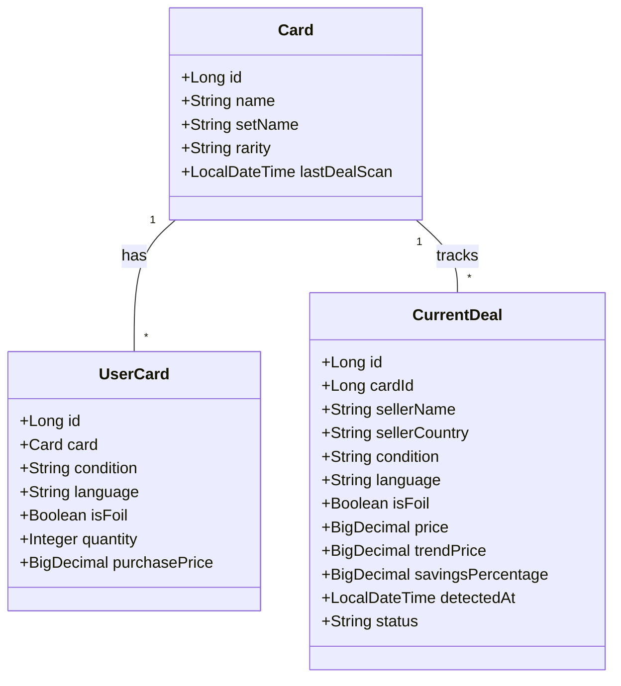

# Architecture Document for MTG Copilot

## Microservices Architecture

This project is structured as a microservices application, comprising several key modules:

*   **`mtg-gateway`**: Intended to be the entry point for API requests, routing them to the appropriate backend services.
*   **`mtg-collection-service`**: Manages the user's personal collection of Magic: The Gathering cards. It handles data related to owned cards, their conditions, languages, quantities, and purchase prices. It also serves the frontend UI using Thymeleaf, Tailwind CSS, and HTMX.
*   **`mtg-market-service`**: Responsible for interacting with market data (like Cardmarket). It tracks current deals, pricing trends, and calculates savings. It exposes a REST API for the collection service to consume.
*   **`mtg-ai-orchestrator`**: Designed to be the AI engine of the application. It will process natural language queries from the user using Spring AI and translate them into actionable requests for the other services.

## AI Function Calling Flow (Proposed)

When a user submits a natural language request (e.g., "Trouve moi 4 cartes Sol Ring de Strixhaven au meilleur prix et avec les frais de ports les moins chers") via the Command Palette in the UI:

1.  **Frontend (HTMX)**: The `layout.html` captures the input and sends an HTMX POST request to the backend.
2.  **`mtg-collection-service` (UIController)**: The controller receives the request and forwards it to the `mtg-ai-orchestrator`.
3.  **`mtg-ai-orchestrator` (Spring AI)**:
    *   The orchestrator uses an LLM (Local or Cloud) to parse the intent and extract parameters (Card: Sol Ring, Set: Strixhaven, Quantity: 4, Optimization: Best Price + Shipping).
    *   It identifies the appropriate "Tool" or "Function" to call based on the intent (e.g., `searchBestOffers`).
4.  **Tool Execution**: The defined function is executed. This function will likely make internal API calls to `mtg-market-service` and potentially `mtg-collection-service` to gather the necessary data.
5.  **LLM Synthesis**: The results from the tool execution are passed back to the LLM. The LLM formulates a human-readable response based on this data.
6.  **Response Delivery**: The orchestrator returns the response to the `UIController`, which renders a Thymeleaf fragment or raw HTML back to the frontend, updating the UI dynamically via HTMX.

## Database Schema (PostgreSQL)

The application uses PostgreSQL. The schema is currently managed by Flyway within the `mtg-collection-service` (though ideally, each service would manage its own schema).

### Entity-Relationship Diagram

